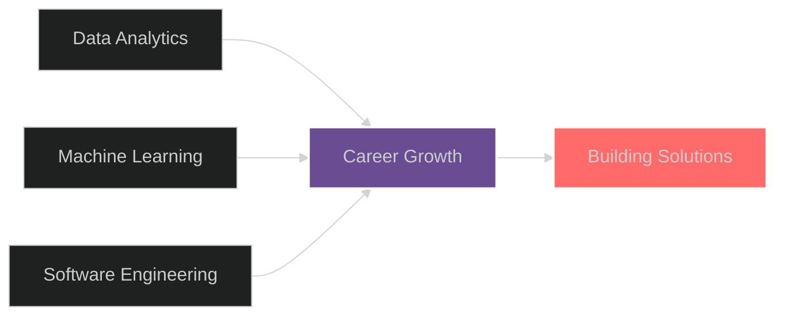

<div align="center">

<!-- Animated Header with Typing Effect -->
[](https://git.io/typing-svg)

<!-- Profile Views Counter -->


<!-- Social Links with Hover Effects -->
[](https://linkedin.com/in/kevinvasilescu)
[](mailto:vasilescukevin@gmail.com)
[](https://github.com/kevin-vasilescu)

---

### 💫 About Me

```typescript
const kevin = {
    education: "Computer Science @ TMU",
    focus: ["Data Science", "Analytics", "Machine Learning"],
    currentlyLearning: ["Python", "Ruby", "C++", "Rust"],
    lookingFor: "Data Analyst & Software Engineering Opportunities",
    funFact: "I turn data into insights and coffee into code ☕"
};
```

</div>

---

## 🛠️ Tech Stack

<div align="center">

### Languages


### Data Science & ML


### Tools & Platforms


</div>

---

## 📊 GitHub Analytics

<div align="center">
  
<!-- GitHub Stats Card with Custom Theme -->


<!-- Top Languages Card -->


</div>

<div align="center">

<!-- GitHub Streak Stats -->
[](https://git.io/streak-stats)

</div>

<div align="center">

<!-- Activity Graph -->
[](https://github.com/ashutosh00710/github-readme-activity-graph)

</div>

---

## 🏆 GitHub Trophies

<div align="center">

[](https://github.com/ryo-ma/github-profile-trophy)

</div>

---

## 🎯 Current Focus

<div align="center">



</div>

- 🔭 Working on **data science and analytics projects**
- 🌱 Learning **advanced Python, C++, and Rust**
- 👯 Looking to collaborate on **open source data science projects**
- 🎓 Pursuing opportunities in **Data Analytics & Software Engineering**
- 💬 Ask me about **Python, Data Analysis, Machine Learning**
- 📫 Reach me at **vasilescukevin@gmail.com**

---

## 📈 Contribution Graph

<div align="center">


</div>

---

<div align="center">


### ✨ Show Some Love

If you like my work, consider giving a ⭐ to my repositories!

</div>
